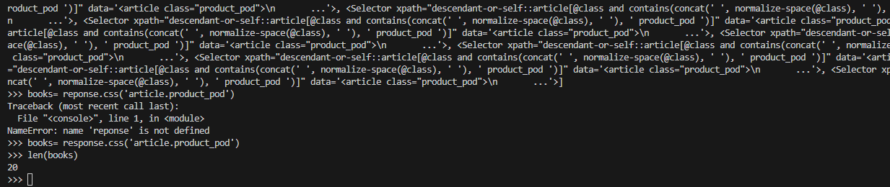
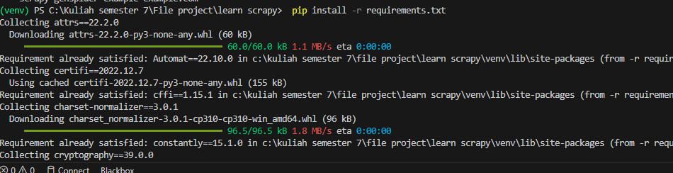
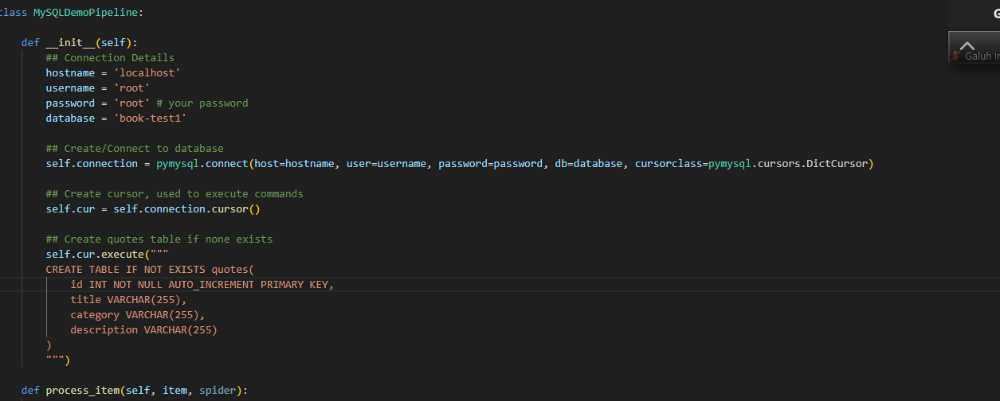

Installing Scrapy
## Following tutorial"https://www.youtube.com/watch?v=mBoX_JCKZTE"
Scrapy is a Python-based web scraping framework. This README provides instructions for installing Scrapy on your local machine.

Prerequisites

Before installing Scrapy, make sure you have the following software installed:

    Python (version 3.6 or higher)
    pip (Python package manager)
    Microsoft Visual C++ 14.0 (required for some Windows installations)

Installing Scrapy

To install Scrapy, follow these steps:

    Open a terminal window.
    Run the following command to install Scrapy using pip:

pip install scrapy

    If the installation is successful, you should see a message similar to the following:

Successfully installed Scrapy-2.5.1 ...

    To verify that Scrapy is installed correctly, run the following command:

scrapy version

This should output the version number of Scrapy.

dont forget install requirement

and connect to database
