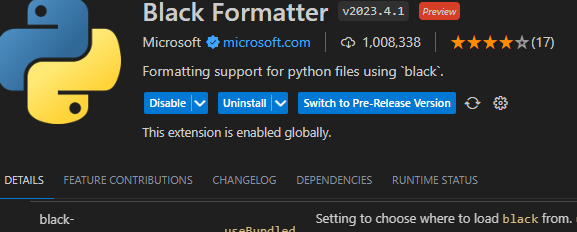
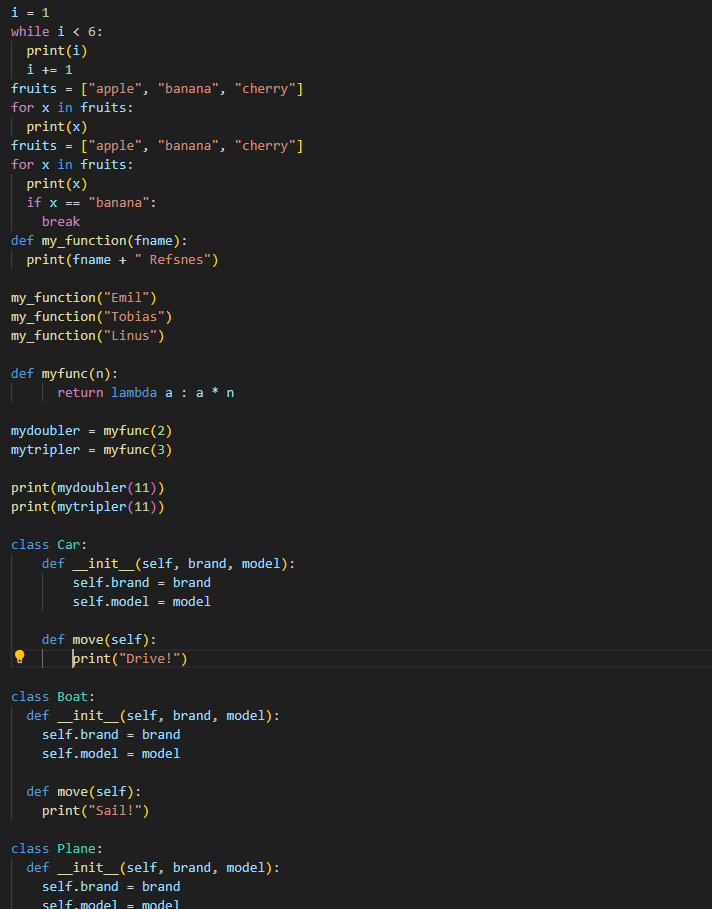
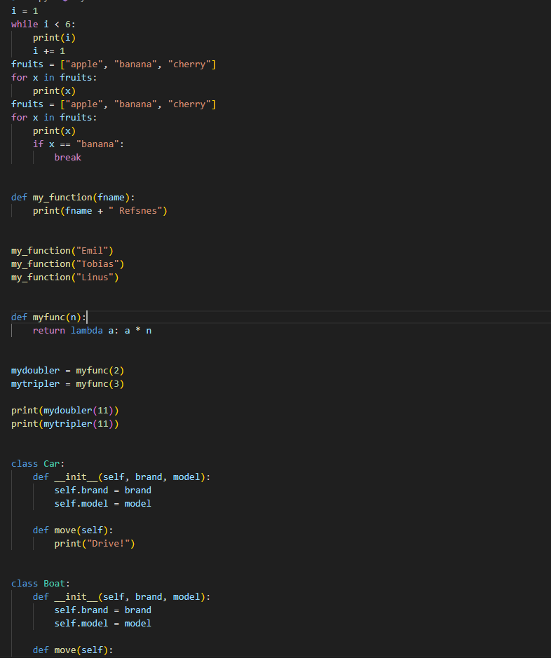

## install agar autosave ke pep8

Linter seperti pycodestyle atau flake8 menunjukkan apakah kode Anda sesuai dengan format PEP8, yang merupakan panduan resmi gaya Python. Namun masalahnya justru memberikan beban bagi developer untuk membenahi gaya pemformatan ini. Di sini Hitam berperan tidak hanya melaporkan kesalahan format tetapi juga memperbaikinya.

### tampilan setelah terinstall

### contoh sebelum menggunakan black formatter

### setelah menggunakan black formatter

